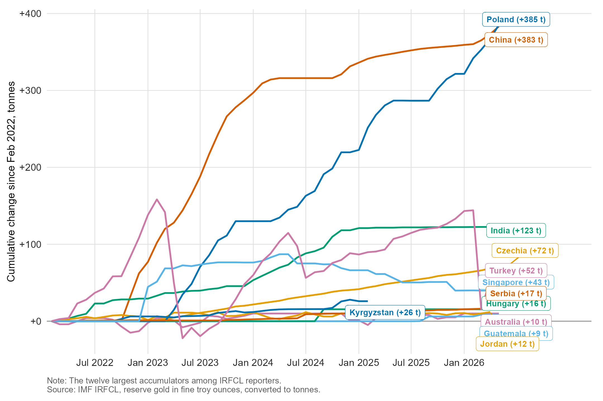

**Abstract.** Geopolitical stress events form predictable capital reallocation corridors, where small neutral open economies are of key importance in recording the measurable first-mover signal. This analysis develops the concept of a corridor system for the reallocation of sovereign capital during the period from 2022 to 2026, from the freezing of the reserves of the Central Bank of the Russian Federation to the closure of the Strait of Hormuz. Based on the analysis of internationally comparable data on the balance sheets of central banks, two successive waves are recorded: Russian (since 2022) and Iranian (since 2025). The latter was directed along the same geographical corridor, from stress zones to terminal havens, passing through the territory of neutral transit economies. Empirical analysis shows that capital flows are primarily recorded not in destination countries, but in small neutral economies located along the corridor. The central banks of these countries carry out urgent interventions and sterilizations. As a result, the corresponding extraordinary operations are reflected in official statistics weeks in advance, before the publication of official data on capital flows. Armenia is a key example of this mechanism. In January 2026, the Central Bank of Armenia carried out extraordinary liquidity management operations eleven days before the official recording of the Iranian capital inflow, which is also fully consistent with the developments in 2022. The methodology of considering the sovereign balance sheets of small neutral economies as leading indicators of geoeconomic stress is reproducible and falsifiable.

**Keywords:** capital flows, capital flight, foreign exchange reserves, sterilization, geopolitical risk, small open economies, financial sanctions, early warning indicators, sovereign wealth funds, Armenia

# Introduction

At the end of February 2026, the Strait of Hormuz, through which about 20 percent of the world’s seaborne oil trade passes, was effectively closed to commercial shipping. The International Energy Agency has classified this event as the largest supply disruption in the history of the global oil market [@iea_oil_report]. By mid-March, daily shipments had fallen to two million barrels, down from twenty million before the crisis (Figure 1). The impact of the crisis on energy markets was immediate and visible. However, the disruption of capital flows, which is the main subject of this analysis, was initially unnoticed. It had been underway for months before the strait was closed, circulating through channels that are recorded by traditional statistics only with a certain time lag. As a result, the process was mainly manifested in economies that are rarely considered in the professional literature on the geopolitical movements of capital.

This article presents a simple observation about international political economy. The geopolitical stress events recorded in 2022-2026 (the freezing of Russia’s foreign exchange reserves, the imposition of secondary sanctions, the systemic devaluation of the Iranian currency, and the closure of the Strait of Hormuz) did not lead to a random movement of capital to safe havens. On the contrary, financial resources have been channeled through predictable and structurally stable corridors. These geographic vectors connect stress zones with terminal havens through small, neutral transit economies. Given the volumes of transit economies are disproportionately small compared to the financial flows passing through them, local central banks are forced to respond promptly to the process through foreign exchange interventions, the accumulation of reserves, and the sterilization of excess liquidity. These operations are made public long before their cash flows have time to be reflected in balance of payments statistics, banking system reporting, or GDP indicators. The balance sheet of a small neutral open economy is therefore the first and most reliable evidence of a geoeconomic stress event: the shifts recorded in small open economies later become apparent to the whole world.

This analysis combines three research threads that have so far developed separately. The first concerns the dollar-centric monetary system and its problems, starting from the political economy of the recirculation of petrodollars [@spiro1999hidden; @momani2008gulf], continuing with the analysis of dollar hegemony [@norrlof2014dollar; @fields2013hegemonic; @costigan2017us] and reaching the contemporary debates on the geopolitics of fragmentation and reserve structure [@arslanalp2022stealth; @weiss2022geopolitics; @chinn2024dollar; @pforr2025dollar]. These works are considered solely as a context: the purpose of the analysis is not to discuss the prospects for the dollar's position, since the developments in 2022-2026 are not sufficient to give a final assessment of this issue.

The second direction is the sharp increase in capital flows, sudden stops, and their management. Scientific research has shown that the sharp increase in inflows is periodic and destabilizing in nature, often leading to crisis consequences [@agosin2012overreaction; @forbes2013capital; @eichengreen2018managing; @teimouri2018impact]. Moreover, the mechanisms and costs of the main tool for its absorption, the accumulation and sterilization of reserves, have been sufficiently studied [@aizenman2009sterilization; @mohanty2006foreign; @levy2020cost].

The third direction is the approach to early warning systems [@kaminsky1998leading], which aims to identify indicators that predict currency and financial crises [@kaminsky1999currency; @frankel2012can; @aldasoro2018early]. In this article, we aim to rethink the logic of early warning: instead of looking for indicators that predict the internal crisis of the economy under consideration, we analyze factors that indicate shocks in other countries, considering a small neutral economy as a responsive sensor, rather than a crisis-bearing entity.

Closer to this approach is the work of An and Huber (2026) [@an2026geoeconomic], which documents how geopolitical competition leads to capital reallocation in global currency financing markets. The object of their study is the global market for bank swaps, based on pricing data from global banks. The object and methodology of this analysis are initially different: the sovereign balance sheets of small neutral economies are studied, where capital reallocation is reflected not in the difference in basis points, but in the public operations of the central bank. In particular, this is manifested by an increase in the volume of repo transactions, the accumulation of reserves, or the extraordinary issuance of sterilization securities. These two approaches complement each other, but the advantage of the sovereign channel is that its impact is visible in open data published on a weekly basis, which provides an opportunity to empirically test the “first-mover” hypothesis.

This analysis is driven by three main gaps in the literature. First, none of the existing studies consider the 2022-2026 reallocation at the corridor level as stable geographical paths; it is presented purely as episodes of bilateral flows. Second, there is a lack of studies that use balance sheet data of central banks of small neutral open economies as primary indicators of geoeconomic stress. The early warning literature is based on macroeconomic indicators of the crisis country, while the geopolitical literature is based on price data of developed markets. Third, the recurring first-mover pattern (the Russian waves of 2022 and the Iranian waves of 2025-2026, recorded in the same small economy) has not been previously identified, although its first phase was available in real time in the weekly publications of the Central Bank of Armenia’s operations.

The structure of the article is presented below. The second section describes the corridor system and the first-mover mechanism. The third section maps the two waves of reallocation in 2022-2026 using internationally comparable statistics on reserves. The fourth section presents in detail the Armenian example: the 2022 precedent, the unexpected economic growth rate in 2025, and the Central Bank’s operations in January 2026, which preceded the official recording of the Iranian wave by eleven days. The fifth section generalizes the methodology to other neutral small economies and defines the conditions under which the hypothesis can be refuted. The sixth section summarizes the results obtained.

About the data used in this paper: This work is an analysis of mechanisms, and the arguments used are descriptive in nature — indexed series of reserves, mapping of accumulations and chronology of processes. Constructing early warning regression models was not considered appropriate for two main reasons. First, in the conditions of two waves and a limited number of transit economies, any estimated model would be overfitted to the very episodes it was supposed to predict. Second, from a purely methodological point of view, the value of the signal is its simplicity and comprehensibility: the extraordinary repo operation of 272 billion Armenian drams (AMD) carried out on January 14, 2026 is a fact, not a modeled result. Therefore, following the traditions of the descriptive literature on corridor systems [@norrlof2014dollar; @fields2013hegemonic], the analysis is based on the actual volumes and chronology recorded. At the same time, precise numerical estimates in the face of deep uncertainty require a cautious approach, favoring range and trend analysis [@tavadyan2022uncertainty].

# Reallocation corridors: a conceptual approach

## From push and pull factors to corridors

The traditional analysis of international capital flows is conducted in the context of push-pull factors, where global factors push capital away from certain markets and local factors attract it to other markets [@forbes2013capital; @molina2019capital]. This approach is valid for returns-driven flows, but it is not applicable to the analysis of geopolitically motivated capital movements for two main reasons. In this case, the moved capital does not seek to ensure the maximum risk-adjusted return. Therefore, the key characteristic of the destination is not profitability, but jurisdictional neutrality, which visibly excludes the freezing of assets and their transformation into an instrument of state coercion. Second, as a rule, displaced capital cannot be directly transferred from the country of origin to the final destination. The systemic architecture of sanctions, as well as the de-risking of correspondent banking relationships, restrictions on capital movements and operational prohibitions, impose the redirection of capital through jurisdictions that maintain banking links both with the stress zone and with the international financial system. These jurisdictions share legal, linguistic or diaspora infrastructures with the country of origin and are distinguished by sufficient neutrality to manage financial flows without being exposed to the risk of secondary sanctions.

This route is defined as a capital reallocation corridor. It includes a stress zone of origin, one or more neutral transit economies, and a terminal haven. They are interconnected by stable institutional infrastructures: banking links, remittance systems, trade payment channels, and migration networks. The corridor concept is based on academic sources on remittance infrastructures, according to which cross-border financial funds move not through uncontrolled networks, but through stable, institutionalized channels [@rodima2019international; @kireyev2006macroeconomics], and this logic is also applicable to capital transfers at the sovereign level.

Three main characteristics of corridors are key in the context of the analysis. The first is stability: the infrastructure that served the 2022 wave continued to operate in 2025, resulting in a repetitive geography. The second is visibility asymmetry. Terminal havens are large enough to absorb capital flows without immediate macroeconomic shocks. Transit economies do not have such capacity. Third, they are activated, not created, by stress events: the corridor exists in a latent state (in the form of trade, banking, and remittance links) and begins to absorb capital outflows only when the economy of origin is subjected to a shock.

## Power, neutrality, and the geography of refuges

Why is neutrality important in the geopolitical movements of capital? The answer lies in the literature of international political economy that studies the interrelationship of monetary structures and state power. The dollar-based international monetary system is not only a liquidity mechanism but also an architecture of leverage that underpins and supports US structural power [@norrlof2014dollar; @costigan2017us; @vernengo2021consolidation]. This approach predates the modern debate by decades. As early as Strange (1988) [@strange1988states], the financial structure (control over the system of credit creation and value storage) was seen as the primary manifestation of structural power, along with security, production, and knowledge. Kirshner (1995) has shown [@kirshner1995currency] how monetary power turns dependence into a lever of coercion, from the imposition of currency zones to systemic failures, while Helleiner (1994) has noted [@helleiner1994states] that post-war financial globalization was the result of state choice, not market developments. The petrodollar format, which provided the foundation of the system for nearly five decades, effectively guaranteed security against recirculation [@spiro1999hidden; @momani2008gulf]. Developments in 2022 have demonstrated the willingness to use this architecture as a tool of confiscation at the sovereign level. With the freezing of about half of the Russian Central Bank’s reserves, the theoretical risk turned into a real threat for any central bank whose geopolitical orientation could be challenged in any way [@weiss2022geopolitics; @arslanalp2022stealth]. The freeze did not create this risk, but only confirmed it. McDowell noted back in 2021 that the risk of US financial sanctions significantly increases the political cost of dependence on the dollar for states, as a result of which gradual diversification is used as a means of adaptation [@mcdowell2021financial; @mcdowell2023bucking]. Private capital moving through reallocation corridors essentially exhibits the same behavior: it avoids not the dollar itself, but jurisdictions where geopolitical positions can be used against it.

The professional literature on sanctions has documented these consequences in detail. Financial restrictions go beyond the immediate targets: secondary effects force third-country banks to resort to over-compliance, redirecting flows rather than blocking them entirely [@newman2024secondary; @ozdamar2021consequences]. Sanctioned economies adapt by creating new channels of trade and settlement rather than through autarky [@itskhoki2025sanctions; @tan2025decoupling], which is clearly reflected in mirror trade statistics. The redirection of Russian oil flows after 2022 is a vivid example of this logic [@tavadyan2025redirection]. At the same time, private and elite capital responds not only to the actual application of sanctions, but also to their expectations. Capital flight is an indirect but systemic consequence of the threat of sanctions [@reinsberg2024unintended]. In parallel with the growth of geopolitical risks, cross-border capital movements are currently being recorded that are comparable in size to flows caused by interest rate differentials [@feng2023geopolitical; @davis2021foreign]. Moreover, the interrelationship between oil, security and capital flows in energy-exporting regions is not episodic, but structural in nature [@el2018coupled].

This reality directly determines the geography of terminal havens. The final destinations are states endowed with institutional neutrality at the international level (Switzerland, Singapore, UAE). In 2022-2026, pressure on the latter led to changes in domestic macroeconomic policy. In particular, due to the pressures on the appreciation of the national currency, the Swiss National Bank returned to a zero interest rate policy [@swissbanking_outlook]. The Monetary Authority of Singapore, in order to curb capital inflows, tightened the exchange rate management band [@mas_macro_review]. However, transit economies operate between countries of origin and final destinations: Armenia, Georgia, Moldova, Jordan, and the smaller intermediary states of the Persian Gulf. These economies share infrastructure with the stress zone and political neutrality with the terminal havens. This is the key observation of this analysis.

## Why the signal propagates first in small neutral economies

When the crisis activates the capital reallocation corridor, displaced capital enters the transit economy through bank deposits and cash exchange, and then through real estate purchases and company registration. The primary impact is manifested in pressure on the exchange rate and a small oversupply of foreign currency in the domestic market, which activates central bank mechanisms. Even in the short term, the central bank of a small open economy cannot ignore such a phenomenon. Within a few days, the unsterilized flow of capital can undermine exchange rate stability and the monetary base. Therefore, the central bank is forced to buy foreign currency and accumulate reserves, and then to sterilize the resulting excess domestic liquidity through securities issuance, deposit auctions, or repo operations [@aizenman2009sterilization; @mohanty2005intervention; @mohanty2006foreign].

Sterilized intervention mechanisms are among the most widely studied areas of central bank activity [@neely2000changes; @moreno2011foreign], including in the case of small and middle-income economies, which are the subject of this study [@glick2009navigating; @ouyang2011reserve; @ponomarenko2019sterilized; @wu2015open; @bozhinovska2024central]. The academic literature has largely focused on its costs and limitations: the quasi-fiscal costs that arise when interest rates on sterilization instruments exceed the yield on reserves [@kletzer2004sterilization; @levy2020cost] and the portfolio and credit distortions that arise from the placement of sterilization bonds by domestic banks [@benes2015modeling; @yun2020reserve]. To these are added the constraints of the trilemma, under which the entire structure becomes unstable over time [@aizenman2009sterilization; @liu2015optimal], and the global imbalances that arise from the accumulation of large reserves [@alberola2007global; @pineau2006accumulation; @polterovich2003accumulation].

The addition in this approach is that this well-studied mechanism is also considered as a public sensor. Central bank operations are announced, recorded and published, as a rule, on a weekly, and sometimes daily, basis. The reserve position is presented on a monthly basis in the International Monetary Fund (IMF) International Reserves and Foreign Currency Liquidity (IRFCL) format. In contrast, statistics that directly record capital inflows are published with a lag of one to three quarters: balance of payments, external positions of the banking system, national accounts. As a result, a systemic visibility gap is recorded. In a transit economy, policies responding to flows become apparent much earlier than the flows themselves. Since the transit economy is small, the process is not lost in statistical noise. The inflow of corridor volume leads to extraordinary operations that deviate significantly from the normal range. Their detection does not require complex models.

The data are published with high frequency, as this is a direct requirement of monetary policy: the results of auctions, the use of standing facilities and the total volume of interventions are disclosed to the central bank’s counterparties as a mandatory condition for the implementation of these operations, to which is also added the monthly report standardized by the International Monetary Fund. Balance of payments statistics, on the other hand, are a set of aggregated data. They are collected from bank statements, business surveys and customs records, and then subjected to adjustment and revision. This process is lengthy and is done quarterly. The central bank of a transit economy does not send a deliberate signal; the signal is formed automatically, since the mechanisms for implementing the policy are public.

Kaminsky (1998) [@kaminsky1998leading] and related literature [@kaminsky1999currency; @frankel2012can; @aldasoro2018early] look for indicators within an economy that predict crises in that economy. The presented concept suggests considering indicators of a small neutral economy as a source of early information about shocks occurring elsewhere, reserving the role of the economy as a seismograph, not an epicenter. The central bank of a transit economy, simply by carrying out its direct functions, actually records the chronology of the activation of the corridor.

The presented concept implies three falsifiable claims, which are substantiated in the third and fourth sections: 

* **Corridor stability**: in the event of successive stress events, capital should flow through the same transit geography;
* **First-mover timing**: central bank operations in the transit economy should precede both official state records and statistical confirmation in the countries of origin and refuge;
* **Visibility of the scale**: the impact on the transit economy should be significant compared to the overall economy and clearly reflected in reserves and GDP indicators without the need for additional statistical adjustments.

# Stress events and corridor map: 2022–2026

## Context: bypassing the debate over the future of the dollar

The period under study is often presented as one of the stages of the decline of the dollar's dominance, around which there is an extensive academic debate: the historical experience of the transition to reserve currencies [@eichengreen2009rise; @eichengreen2005sterling], the permanent candidacy of the yuan [@subramanian2011renminbi; @hung2013china], the infrastructure of payment systems, stablecoins and digital currency (CBDC) alternatives [@mayer2024dollarization; @fantacci2024stablecoins], the gradual diversification of the reserve structure [@arslanalp2022stealth; @chinn2024dollar], the inertial nature of dollar lending [@gourinchas2021dollar; @habib2015there; @gerding2024dollarization], as well as more critical approaches to the political economy of the system [@desai2021beyond; @pforr2025dollar]. This paper does not express any position on this issue. The corridor mechanism operates regardless of the long-term prospects of the dollar. Capital flowing out of the stress zone through Armenia exhibits the same behavior, regardless of whether it is ultimately expressed in dollars, yuan, or gold. Only one undeniable fact is central to this analysis: after February 2022, both reserve managers and private capital owners began to reassess the risk of asset seizures due to geopolitical orientation [@weiss2022geopolitics], and it was this reassessment that became the main driving force of the two waves presented below.

## The Russian path: 2022–2024

The freezing of the reserves of the Central Bank of Russia in February 2022 was followed by new packages of sanctions and the disconnection of Russian structures from international systems. This led to an outflow of private capital of such volumes that it was clearly reflected in all statistical indicators of the corridor economies. The flows moved through already existing infrastructures: the banking connections of the diaspora and labor migrants, and ruble settlement systems. They also moved along the same trade routes, which were simultaneously being reorganized to redirect Russian exports under sanctions [@itskhoki2025sanctions; @tavadyan2025redirection]. The transit geography was clearly outlined. Armenia, Georgia, Kazakhstan, the UAE and Turkey absorbed the influx of people, companies and deposits. Switzerland and the UAE served as terminal accumulation points [@newman2024secondary; @bficapital_swiss].

The structure of the channel is of key importance for further analysis of data on transit economies. It was not portfolio capital in the classical sense. Hundreds of thousands of individuals moved their savings to countries where visas were not required and language was not a barrier. To maintain access to international payment systems, companies re-registered in Yerevan, Tbilisi, Almaty and Dubai. Deposits were transferred or cashed out at the border, converted into local currency or dollars, or invested in the real estate market. The end result of all these processes was the same: a small excess supply of foreign currency in the domestic market, which activates central bank mechanisms. The reallocation process is notable for its “stickiness”: people, companies and bank accounts move much more slowly than portfolio structures, so the corridor, once activated, maintains capital flows for years. This is what accounts for the continuous deviation reflected in Figure 2, instead of a short-term jump.

Figure 2 presents a general picture of the process. If foreign exchange reserves (excluding gold to neutralize the appreciation effect) are indexed as of February 2022, it becomes obvious that the corridor economies have visibly deviated from both the stress origin zones and the base level of the major economies months after the start of the conflict, and this deviation has been recorded since the end of 2025, in the same direction and in the same sequence.

Three main characteristics stand out in Figure 2. The first is the sequence: small transit economies respond the earliest and proportionally the most. Armenia’s reserves reached their lowest level in March 2022 (the primary response of any small economy to a war in its neighborhood is the expectation of capital outflows), after which they grew by about two-fifths over the rest of the year. Such an accumulation, relative to the size of the economy, has practically no precedent (if we exclude cases caused by commodity super-profits). In early 2026, after the second wave, the indicator exceeded the level of February 2022 by more than eighty percent. The deviation from the base group is further emphasized by the fact that 2022 was marked by the global appreciation of the dollar and revaluation losses caused by rising interest rates. The reserve indices of Japan, India, Hong Kong and Singapore decreased in the same months, while growth was recorded in the transit economies. Therefore, the deviation reflected in the chart is objective: the accumulation of reserves in the corridor economies was recorded contrary to global trends.

The second characteristic is the instructive exception. The dynamics of Turkey’s indicators – a sharp increase recorded in 2022, followed by a prolonged decline – at first glance resembles a corridor logic, but in reality this is not the case, or only partially so. Turkey has indeed had large inflows of Russian capital (including targeted project-based transfers). The dynamics of its reserves, however, are largely determined by its own currency crisis management, where the accumulation and depletion phases are dictated by domestic policy cycles. This example provides a corollary to the concept: a transit economy that is also a crisis economy turns into a sensor transmitting distorted signals (this circumstance is analyzed in more detail in section five). “Clean sensors” include those economies that are small, neutral, and at the same time free from domestic macroeconomic shocks. It is this combination that has led to their neglect by professional literature, but they are exactly what is needed in the proposed methodology.

The third characteristic is repeatability. The deviation recorded at the end of 2025 reproduces the picture of 2022, with a different source of origin but the same transit geography. This directly confirms the hypothesis of corridor stability and excludes explanations due to pure profitability or random factors. If the accumulations in 2022 were explained only by the logic of arbitrage due to the difference in interest rates (carry-trade), then in 2025 the same interest rate differences should have appeared again in the same countries, which did not happen. The corridor hypothesis requires only the presence of the same infrastructure, which was actually provided.

In Figure 3, the same phenomenon is presented in proportion to the size of the economy, which is an accurate indicator for assessing the visibility of volumes: one billion dollars in Japan's reserves is just statistical noise, and in Armenia's reserves it is a structural event.

This approach adds an additional dimension to the corridor map that was hidden in the indexed chart. Moldova, which is rarely mentioned in any reallocation analysis, accumulated reserves equivalent to about twelve percent of GDP between February 2022 and 2026. Serbia and Mongolia, both neutral and bordering Russia, accumulated between nine and ten percent, Armenia almost nine, and Georgia about five. Kazakhstan’s far larger accumulations in absolute terms amount to less than two percent of its GDP. This is the key difference between transit and purely border economies: the same volume of corridor flows has a macroeconomic transformative nature in transit economies, while in the case of larger neighbors they are easily absorbed by the system. Two reservations must be made here. The top positions in the global rankings also include small economies with unique histories of reserve accumulation (Nicaragua, Costa Rica, Jamaica), driven by IMF programs or remittance growth and not tied to any geopolitical corridor, while Ukraine’s accumulation reflects the financial assistance received, not capital flight. For this reason, the methodology described in Section 5 considers anomalies in the context of the corridor map, rather than directly in the rankings. The conclusions are based on chronology and geography, not sheer volumes. The importance of volumes lies in providing visibility: it is in small economies that the traces of the process become apparent without complex statistical adjustments. With this logic, they are chosen as the sensor system, rather than their larger neighbors.

## Sovereign balance sheet reallocation component: gold

Private capital outflows have their sovereign equivalent. After February 2022, central banks (most of which are either non-aligned or adjacent to stress zones) began accumulating gold at the fastest pace since the collapse of the Bretton Woods system. Between February 2022 and early 2026, China increased its gold reserves by about 373 tons, Poland by 367, and India by 123. Czechia, Turkey, Singapore, and Serbia followed suit (Figure 4). The structure of this group explains the situation: the gold hoarders are not yield seekers, but reserve managers for whom the custodial risk was reassessed as a result of the 2022 freezes. Sovereign gold held domestically is the only reserve asset that cannot be frozen by decisions of correspondent banks [@arslanalp2022stealth; @weiss2022geopolitics]. Sovereign gold accumulation is in fact an expression of the same corridor logic already at the official level: a shift from geopolitically vulnerable assets to assets resistant to confiscation. This process is carried out gradually, since sovereign portfolios cannot be rearranged at the speed of capital flight.

Sovereign and private channels are distinguished by significant differences in temporal dynamics, which is of fundamental importance. Private capital flight occurs over weeks and is almost immediately reflected in the operational data of the central banks of the transit economies. In contrast, official diversification is carried out quarterly, as a planned and partly public process, and is reflected in the IMF reserve statistics with a certain lag. However, both respond to the same event of risk reassessment. The literature on the official response to the use of the dollar as a weapon directly documents this motivational structure [@mcdowell2023bucking; @arslanalp2022stealth]. In this analysis, the dynamics of gold indices are considered as confirmation of the driving force, rather than a separate corridor. The accumulation of gold suggests that the risk of confiscation is already being factored in by the system’s most conservative portfolio managers. The same risk is moving private capital between Yerevan and Tbilisi at a hundred times greater speed.

## The Iranian wave: 2025–2026

The second wave was caused by the acceleration of the devaluation of the Iranian rial. The free-market exchange rate crossed the threshold of one million rials per dollar in March 2025, and in January 2026 reached about 1.5 million, recording an almost twofold devaluation of the national currency in one year. The process was accompanied by the government’s dismantling of the NIMA subsidized exchange system, which had been providing targeted distribution of foreign exchange to importers since 2018. In the conditions of such a rapidly developing currency crisis, anyone with assets in the national currency turns into a potential exporter of capital. Under four decades of sanctions, Iranian private capital, which has mastered unofficial cross-border channels [@katzman2012iran; @ratner2018iran], did not need new infrastructure to respond adequately. The closure of the Strait of Hormuz in February 2026 and its regional consequences were the second driving factor [@iea_oil_report]. The corridor logic was repeated with the participation of other actors. Capital was channeled along the routes that were possible under the constraints of geography and sanctions. In the north, it moved through the banking system of Armenia, where the land border and existing correspondent network allow for large-scale transfers. In the east, it moved through intermediary countries in the Persian Gulf, where the UAE again acted as a transit and terminal hub [@atlantic_tehran_toll]. The driving factor in this case was initially different from the 2022 precedent. The Russian wave was triggered by a clear legal process, through the application of sanctions, while the Iranian wave was conditioned by the ongoing macroeconomic decline amid increasing external sanctions and pressure, which accelerated with each new round of devaluation of the national currency and could only end with stabilization or complete depletion of resources.

The Gulf states were historically a source of recirculating surpluses. Now they have become a stress zone and, at the same time, an agent of reallocation. The closure of the Strait of Hormuz has dramatically reduced the generation of surplus funds that feed the recirculation mechanism. The retained resources have been used for other purposes. Gulf sovereign wealth funds, the world’s largest source of discretionary capital (with around $5 trillion in assets under management), continued to invest during the crisis quarter, but have been significantly redirected towards private placements, domestic resilience building, and non-Western infrastructure [@enterprise_gulf_funds]. This shift is a logical continuation of the two-decade evolution of sovereign wealth funds, starting with passive investments in US Treasury bonds [@helleiner2008states; @drezner2008sovereign], after 2008 with the transition to a direct share model [@lenihan2014sovereign; @overbeek2012sovereign], to the current strategic and domestically oriented investment policy [@braunstein2019domestic; @alshareef2023gulf; @megginson2023sovereign; @lopez2023swf; @cumming2017oxford]. Of key importance in the context of the corridor map is the fact that the reorientation of the Gulf states eliminates the traditional terminal sink of the system - recirculating dollar assets - at the very time when the Iranian route seeks transit routes, which further increases the concentration of flows in small neutral economies.

The pressure on safe havens was immediate. Swiss institutions saw a surge in deposits from the Gulf and the Middle East, which led to a rise in the franc and forced the Swiss National Bank to return to a zero interest rate policy [@bficapital_swiss; @swissbanking_outlook]. Singapore tightened its exchange rate management policy to contain imported inflation while simultaneously absorbing the relocation of family offices from East Asia [@mas_macro_review; @wealthbriefing_immigration]. These developments illustrate the classic difficulties in absorbing capital inflows described in the relevant literature [@agosin2012overreaction; @eichengreen2018managing; @teimouri2018impact], but they only appear in terminal havens after corridor flows have already been recorded in transit economies. The end-2025 deviation reflected in Figure 2 starts in Yerevan, not Zurich. The fourth section presents its precise chronology.

There is also one apparent contradiction in Figure 2, the clarification of which allows us to fully understand the visibility mechanism: haven countries do not increase reserves. Switzerland’s reserve ratio decreases over the period under review, while Singapore’s remains unchanged, despite the fact that both countries have absorbed historic volumes of private capital. This disproportion is structural. In the terminal haven countries, capital inflows are absorbed by the private financial system (in the form of deposits, assets under custody, and managed funds), and their macroeconomic impact is reflected in the price of money (the Swiss National Bank’s zero threshold, the Singapore exchange rate band), and not in the central bank’s balance sheet. In these countries, reserve movements reflect the management of reserves accumulated from past interventions, not current flows. In contrast, in transit economies, it is the central bank that has to absorb these flows. Due to this circumstance, the intermediate part of the corridor is clearly reflected in the sovereign data, while its ends become visible only later, through private sector statistics. The system’s main sensor, in other words, is in the middle of the corridor.

# The first-mover signal: the predictive role of the Central Bank of Armenia

## Why Armenia is a prime example

Armenia’s economy is a perfect sensor for both corridors. It is small (GDP is around $30 billion), open, and has a high degree of institutional neutrality. The country maintains banking and trade relations with both Russia and Iran, while remaining an integral part of the international financial system. Armenia is located at the crossroads of physical and financial routes from Iran to the north and from Russia to the south. It is the only country neighboring Iran that simultaneously has a visa-free regime for Russian citizens, is part of the Eurasian Economic Union labor market, and is integrated into Western correspondent banking networks. The hidden corridor infrastructures described in the second section have particular depth here: a large diaspora, stable remittance channels (gross remittances from Russia alone amounted to $3.8 billion in 2024, or more than one-eighth of GDP, making Armenia one of the most remittance-dependent economies in the world), and a banking system that has traditionally handled transactions in both rubles and dollars [@kireyev2006macroeconomics; @rodima2019international]. The capital account is open, the exchange rate is floating (managed by interventions), and, most importantly for the purposes of this analysis, the Central Bank publishes operational data at a high frequency, including daily analytical indicators of its balance sheet [@cba_analytical_accounts]. Local expert analyses have already documented the pattern of how the economy systematically absorbs and compensates for the region's foreign political risks [@dunamalyan2023economic], and the country's export and economic growth statistics have repeatedly documented geopolitical restructuring processes (in particular, the redirection of trade flows related to Russia after 2022) much earlier than they would have been recorded by international observers [@tavadyan2025redirection; @tavadyan2023navigating].

## 2022 precedent

The impact of the Russian wave in Armenia became apparent days after the conflict began, and the initial reaction was a shock due to misdirected expectations. In February 2022, market behavior was shaped by the precedent of 2014, when the Russian ruble crisis was transmitted to Armenia through remittances, leading to a sudden devaluation of AMD from 410 to 480 drams per dollar in a short span of 2 days. All market participants expected a repeat of the same scenario, and already in March, reserves decreased to their minimum level, as the Central Bank restrained the expected devaluation through interventions. Then the reallocation corridor was activated. The volume of remittances entering the Armenian banking system increased 2.5 times during 2022, and the inflow from Russia in particular increased 4.5 times. Tens of thousands of individuals arrived with their savings, thousands of companies were re-registered, cash crossed the border and was converted into local currency. The expected shock caused by the ruble crisis led to the diametrically opposite result: AMD appreciated from 480 to 400 drams per dollar, while the dollar appreciated against almost all currencies, registering the highest appreciation index among the world's convertible currencies at the end of the year.

The Central Bank’s actions clearly corresponded to the sterilization logic described in the second section, and on an unprecedented scale in the history of the CBA. As a result of intervention purchases, foreign exchange reserves were restored from a low of $2.9 billion in March to $4.1 billion in December, while liquidity-absorbing operations restrained the growth of the money supply in the market [@cba_analytical_accounts]. Each stage of this process was recorded in real time: the total volumes of interventions, reserve positions, and the use of sterilization tools were published on a daily and weekly basis. The banking system’s profits, driven by the conversion margin and the sharp increase in the volume of deposits, tripled during the year.

The official statistical confirmation came quarters later, with international organizations underestimating developments throughout the process. In 2022, Armenia’s GDP grew by 12.6 percent, the highest rate since the economic boom of the mid-2000s, in contrast to pre-war low-single-digit forecasts and wartime revisions that initially projected a decline based on the assumption that the economy, dependent on Russia, would inevitably suffer from its isolation. The forecasts based on traditional statistics were not only late but also had the opposite sign, as traditional models viewed Armenia as a country directly vulnerable to the stress zone, rather than a corridor for capital flight. The sequence that is central to this concept formed by the end of the year. Operational data responded first, the exchange rate and reserves second, and national accounts last, with each phase following the previous one with a lag ranging from weeks to quarters.

Further developments completed the cycle predicted in the literature on the sharp increase in capital inflows [@agosin2012overreaction; @teimouri2018impact]. As the wave subsided, economic growth returned to its long term average: in 2023 it amounted to 8.3 percent, in 2024 - 5.9, and in the fourth quarter of 2024 - 3.8 percent, which is actually equivalent to the structural growth rate of the economy (about 4.5 percent) [@tavadyan2023navigating]. During that period, this episode was perceived as a one-time profit gain, and by the end of 2024 a consensus view had been formed that this profit had already been exhausted. However, in the proposed concept, this process is viewed as the first manifestation of a recurring pattern: the corridor sensor recorded the first wave, then returned to the base level, waiting for the second activation. The second activation was recorded in less than a year.

## Eleven-day forecast of January 2026

The second episode tells us more, as the chronology of events is clearer here. On January 14-15, 2026, the volume of repo operations of the Central Bank of Armenia increased sharply overnight, from 130 billion to 272 billion AMD. Such a doubling of an indicator stable for weeks is typical of an emergency situation, not everyday liquidity management. This was evidence of a sudden and significant shift in liquidity in the banking system, consistent with a corridor-scale capital inflow and transformation. Eleven days later, on January 26, the first official confirmation was made that large volumes of flows of Iranian origin were moving through the Armenian banking system. Statistical confirmation of the data was recorded months later. Figure 5 presents the chronology of events.

Data on reserves confirm the above: as of March 2026, Armenia’s foreign exchange reserves (excluding gold) were already more than eighty percent higher than in February 2022. About forty percent of the four-year increase occurred in the five months after October 2025, when the depreciation of the Iranian rial in the free market accelerated and the second corridor shown in Figure 2 began. During the same months, official reserves crossed the $5 billion mark for the first time in the country’s history [@cba_analytical_accounts]. In essence, the second wave was being absorbed by the still-unrepaid first wave.

Macroeconomic data, when finally published, showed a significant influx. In 2025, Armenia’s GDP grew by 7.2 percent (versus the IMF’s forecast of 4.5 percent and the World Bank’s 5.0-5.2 percent predictions), the rise of which was recorded in the last quarter of 2025, growing close to 10 percent. The structure of growth itself suggests a corridor nature: construction grew by 21 percent, information and communication technologies (ICT) by 18.6 percent, and financial services by 14.7 percent. Such a structure implies capital inflow and absorption rather than trade [@tavadyan2023navigating]. The inaccuracy of the forecasts itself confirms the hypothesis of a visibility gap. The estimates of structures guided by traditional statistics were 2-3 percentage points lower than the actual result, which had already been announced months ago by the Central Bank’s statistics on operations.

Another signal recorded during the same period shows that the sensor is able to pick up more than capital inflows. In March 2026, the ruble depreciated by 10.8 percent, while the price of Brent crude oil rose by 46 percent. This phenomenon indicated a break in the two-decade-old “oil-ruble” correlation, when it became zero. In Armenian markets, which handle a significant volume of ruble transactions, this deviation was recorded in real time. The break indicated that oil revenues were no longer being transferred through Russia’s external accounts through normal channels (delays in settlements, suspension of fiscal rules, restrictions on yuan channels). In essence, information about the economy of origin became analyzable in the market data of the transit economy much earlier than it could be collected from Russian sources.

Figure 6 presents the Armenian impulse in a comparative context. When comparing the change in the policy rate with the dynamics of reserves, the difference between currency-protecting and inflow-absorbing economies becomes apparent. In both waves, the corridor economies are concentrated on the absorption side, accumulating reserves without the sharp defensive rate increases visible among the protecting economies. Armenia's rates rose by about 1.5 percentage points in 2022, in line with the global tightening of that year, and stayed flat in 2025–26; an inflow chasing yield would have required the opposite pattern. In the absence of interest rate protection, the accumulation of reserves is the main factor that distinguishes capital flight from pure interest rate arbitrage (carry trade) in cross-sectoral analysis [@davis2021foreign; @feng2023geopolitical].

## The cost component: why the impulse cannot be suppressed or hidden

It could be argued that the central bank, aware of its sensor role, could deliberately attenuate or conceal the impulse. However, the sterilization literature clearly states that this is not possible. Absorption of corridor inflows is a costly process: paying local interest rates on sterilization instruments in exchange for low-yielding reserves leads to large quasi-fiscal costs [@kletzer2004sterilization; @levy2020cost], creates a problem of distortion of bank balance sheets [@benes2015modeling; @yun2020reserve], and increases the pressure of the trilemma on monetary autonomy [@aizenman2009sterilization; @wu2015open]. The central bank of a small country facing sudden inflows has no “silent” alternative. Unsterilized absorption clearly affects the exchange rate and inflation, while sterilized absorption is immediately reflected in operational data. The experience of Macedonia and other small economies suggests the same inevitable dependence [@bozhinovska2024central; @glick2009navigating]. The signal is credible precisely because it is costly: central bank operations of such a scale can never be considered discretionary or imitative phenomena.

The Central Bank of Armenia balance sheet records the accumulation of these costs in real time. In January 2025, the CB’s net domestic assets, which are effectively a sterilization buffer, amounted to 649 billion AMD. By the spring of 2026, seventy percent of this buffer had been exhausted, leaving less than 200 billion AMD [@cba_analytical_accounts]. The buffer is clearly limited. If the 2026 pace were to continue for several more quarters, it would be completely exhausted, as a result of which further inflows would be directly reflected in the monetary base. The operation of the system’s sensor not only requires financial resources, but also consumes the toolkit that generates the impulse. This circumstance once again proves the credibility of the signal (no central bank will exhaust sterilization reserves for demonstration purposes), and at the same time outlines the policy dilemma that is analyzed in the fifth section.

# What do small open economies record first: a replicable methodology

## Clear formulation of the methodology

The empirical procedure applied in sections three and four on the example of Armenia can be generalized and extended to any economy that satisfies three main conditions. It should be small (the volume of flows is large compared to the financial system), neutral (able to serve both sides of the geopolitical dividing line), and transparent (publishes reserves and operational data at a high frequency). The methodology envisages the following steps: (i) monitoring central bank operations (repo instruments, deposit auctions, intervention disclosures) on a weekly basis, (ii) monitoring monthly reserve positions in the IMF IRFCL format (without gold to filter out the effect of revaluation), (iii) recording and compiling a chronology of operations that deviate from the historical range, (iv) cross-sectional analysis of the observed deviations in the context of the corridor map. A single transit economy deviation may be statistical noise, but simultaneous anomalies along a corridor indicate the presence of a wave. All baseline data are free and publicly available. The procedure described does not require the sophisticated econometric tools typical of the early warning literature [@kaminsky1998leading; @frankel2012can], since in the proposed model precise location replaces statistical inference: the sensor is placed where the signal-to-noise ratio is structurally high.

The set of potential sensors can be identified ex ante. In the case of the Russian corridor, these are Armenia, Georgia, Kazakhstan, and Moldova. The 2022 wave already provides an opportunity for retesting beyond Armenia, as the accumulation of reserves in Georgia and Moldova (about five and twelve percent of GDP, respectively, Figure 3) was recorded in the same months. It is this synchrony along the corridor (and not the magnitude of any individual economic indicator) that distinguishes a systemic wave from a local deviation. In the case of the Iranian corridor, Armenia, the small intermediary states of the Persian Gulf, and Jordan again act as sensors. In the case of a possible East Asian corridor (the stress scenario to which this concept is most clearly applicable), Singapore could play a transit role, although it is a noisier sensor due to the size of its economy [@mas_macro_review]. At the same time, the Swiss example has a definitional caveat: the Swiss National Bank’s reserve data reflect revaluation and intervention decisions, which complicates their straightforward interpretation. The presented concept predicts (which is subject to refutation) that a possible future stress event in East Asia will be recorded first in the sovereign operations data of Singapore and, as a secondary stimulus, in the Gulf countries, well before it is reflected in the statistics of the countries of origin or in the official confirmations of the terminal havens.

## Limits of applicability and conditions for refutation of the concept

The limitations of the concept should be as clearly defined as the methodology itself. First, the sensor records the activation of the corridor, not its cause. In January 2026, it became clear that large capital flows were entering Armenia, but this fact alone did not yet indicate that the driving factor was the rial. Identifying the causal link requires comparative and event-based contextual analysis. Second, the transit economies themselves can turn into stress zones, as a result of which the impulse is reversed, and the sensor begins to signal its own crisis (a classic early warning case) [@kaminsky1999currency]. Third, the visibility gap can be eliminated: if balance of payments reporting accelerates to weekly frequency, or if central banks stop publishing operational data, the time advantage will decrease in both directions. However, the literature on reserve accumulation suggests that neither of these changes is realistic in the near future [@pineau2006accumulation; @aldasoro2018early].

The falsifiability of the approach is quite clear, which is seen as the main advantage of the proposed concept over the de-dollarization theories it deliberately avoids. The corridor stability hypothesis will be refuted if, during the next stress event, capital is directed to a new geography that is in no way connected to existing infrastructure. The first-mover claim will be refuted if, during the next wave, the operations of the central bank of the transit economy do not anticipate, but follow official records. This is a check that will be carried out on the basis of open data in the days following the next event. The observations of 2022 and 2026 are two successful cases of this check: a regularity is recorded, not an absolute law, and the final assessment will be given by the third observation [@tavadyan2022uncertainty].

## Consequences for absorbing economies

For transit economies themselves, the sensor status is dual. Inflows provide expansionary economic growth, which was clearly reflected in Armenia’s unprecedented macroeconomic indicators in 2022 and 2025. However, the literature on the rapid growth of capital clearly warns of the following risks: overheating of the economy, real exchange rate appreciation, credit bubbles, and a hard exit when the corridor is deactivated or reversed [@agosin2012overreaction; @teimouri2018impact; @eichengreen2018managing]. Over time, sterilization costs accumulate [@levy2020cost; @liu2015optimal], and the accumulation of reserves, as a means of self-insurance, obeys the law of diminishing returns [@polterovich2003accumulation; @frankel2012can]. Armenia's history already testifies to the consequences of such an outcome: when the corridor volume flows reversed in 2009 and 2014, the market adjustment was expressed in double-digit depreciations after prolonged periods of artificially suppressed volatility.

The same pressure is also measurable in 2026, when the exchange rate volatility is half its long-term average. In the presented concept, this phenomenon is interpreted not as stability, but as a “spring-loaded” state of the cycle. The transit economy, aware of its corridor position, can at least purposefully manage this cycle. Policymakers, analyzing their own operational data, possess the earliest information available in the system about the shock that will soon be reflected in all other markets.

# Concluding observations

This analysis argues that it is appropriate to consider the 2022-2026 reallocation of sovereign capital not as an episode of the rise or fall of any individual currency, but as the activation of stable reallocation corridors as a result of successive stress events. Moreover, the most informative part of these corridors is their intermediate link. Small neutral open economies, due to their size, geographical and political location, as well as the publicity of the forced response of central banks, are considered primary sensors of the financial system. According to Central Bank of Armenia data, the start of the Iranian wave was recorded eleven days before its official confirmation and a full quarter before its statistical reflection, repeating its own 2022 experience. The same data were available free of charge and in an open format.

From an international political economy perspective, these findings shift analytical attention. The literature on geopolitical fragmentation has largely focused on the core elements of the system: reserve structures, payment infrastructures, and global bank financing markets [@an2026geoeconomic; @mayer2024dollarization; @chinn2024dollar]. Peripheral economies have been viewed exclusively as the direct victims of sanctions or the bearers of the consequences of sudden capital stops. This study argues that the latter are also the most sensitive toolkit of the system: the points where geopolitics and capital first intersect are precisely the small economies that serve both sides of the dividing line. Power-analytical writings on the monetary world order [@norrlof2014dollar; @fields2013hegemonic] consistently argue that structural power is visible in the behavior of states. The contribution of this paper is that it records which specific countries make this visible first, and in which specific statistical data.

The presented concept is falsifiable in the horizon of months, not decades. The next stress event, regardless of its origin, will either move through the existing corridor geography and be recorded primarily in the sovereign operations of transit economies, or it will not. This prediction has already been officially recorded, and the weekly operational publications of several small central banks will provide the final assessment.

# Acknowledgements 

First and foremost, I would like to thank my father, Ashot Tavadyan; my mentor and friend, co-author of some of the previous works mentioned here [@tavadyan2025redirection; @tavadyan2023navigating], and Chairman of the Control Chamber of the Republic of Armenia from 1996-2002. I wrote this paper alone, which I could only do after his long-term mentorship, and its shortcomings are my own. I also express my gratitude to the Armenian State University of Economics and the Russian-Armenian University.

Parts of this paper were first developed and published in the analysis section of tvyal.com, where I have been writing since 2023. Without the establishment of this website and constant work on it, I would not have been able to start and finish this project. I would especially like to mention the analyses on [the broken oil-ruble relationship post Hormuz closure (March 2026)](https://tvyal.com/analysis/en/2026/2026-03-24/) and on [Iranian capital flight (April 2026)](https://tvyal.com/analysis/en/2026/2026-04-17/). 

# Disclosure Statement 

The author declares that there are no conflicts of interest. This research was done with no funding.

# Data Availability Statement 

All series used in the figures come from free, publicly available primary sources: the IMF International Reserves and Foreign Currency Liquidity (IRFCL) and World Economic Outlook databases, the IMF PortWatch platform, and the daily analytical accounts of the Central Bank of Armenia [@cba_analytical_accounts]. The R scripts that take this data and reproduce each indicator are available from the author on the [GitHub platform](TODO: need the github link). You can see a continuous update of the monitoring procedure described in section five at https://tvyal.com/rate/stress.

# References
